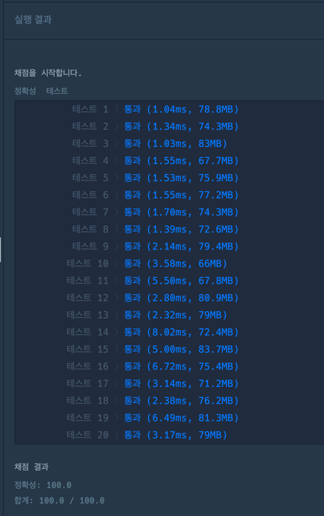

<div align="center">
<h1>🔥 개인정보 수집 유효기간 🔥 </h1>
</div>

<br>

### **[ INDEX ]**
<details>
<summary>1. 문제 링크</summary>

[개인정보 수집 유효기간](https://school.programmers.co.kr/learn/courses/30/lessons/150370)
</details>
<details>
<summary>2. 문제 풀이</summary>

```java
public class Solution {
    static Map<String, Integer> termsMap = new HashMap<>();

    public static void main(String[] args) {
        String today = "2022.05.19";
        String[] terms = {"A 6", "B 12", "C 3"};
        String[] privacies = {"2021.05.02 A", "2021.07.01 B", "2022.02.19 C", "2022.02.20 C"};
        System.out.println(solution(today, terms, privacies));
    }

    public static List<Integer> solution(String today, String[] terms, String[] privacies) {
        List<Integer> answer = new ArrayList<>();
        initTermsMap(terms);
        LocalDate todayDate = convertToLocalDate(today);

        for (int i = 0; i < privacies.length; i++) {
            String[] startDateAndType = privacies[i].split(" ");
            LocalDate expirationDate = convertToLocalDate(startDateAndType[0]).plusMonths(termsMap.get(startDateAndType[1]));
            if (isExpired(todayDate, expirationDate)) {
                answer.add(i + 1);
            }
        }

        return answer;
    }

    private static LocalDate convertToLocalDate(String date) {
        String[] tokens = date.split("\\.");
        return LocalDate.of(Integer.parseInt(tokens[0]), Integer.parseInt(tokens[1]), Integer.parseInt(tokens[2]));
    }

    private static boolean isExpired(LocalDate todayDate, LocalDate expirationDate) {
        return todayDate.isAfter(expirationDate) || todayDate.isEqual(expirationDate);
    }

    private static void initTermsMap(String[] terms) {
        for (String term : terms) {
            final String[] typeAndPeriod = term.split(" ");
            termsMap.put(typeAndPeriod[0], Integer.parseInt(typeAndPeriod[1]));
        }
    }
}
```

**[ 시간 복잡도 - O(n) ]**
</details>
<details>
<summary>3. 코드 결과</summary>


</details>
<details>
<summary>[번외] 객체지향 리팩토링 연습</summary>

```java
public class Solution {
    LocalDate today;
    Terms terms;

    public Solution(LocalDate today, Terms terms) {
        this.today = today;
        this.terms = terms;
    }

    public static void main(String[] args) {
        String today = "2022.05.19";
        String[] terms = {"A 6", "B 12", "C 3"};
        String[] privacies = {"2021.05.02 A", "2021.07.01 B", "2022.02.19 C", "2022.02.20 C"};
        Solution solution = new Solution(convertToLocalDate(today), new Terms(terms));
        System.out.println(solution.solution(privacies));
    }

    public List<Integer> solution(String[] privacies) {
        List<Integer> answer = new ArrayList<>();
        Users users = new Users(privacies);
        for (User user : users.getUsers()) {
            if (!user.isAvailable()) {
                answer.add(user.id);
            }
        }
        return answer;
    }

    public static class Terms {
        private Map<String, Integer> typeAndPeriods = new HashMap<>();

        public Terms(String[] terms) {
            for (String term : terms) {
                String[] typeAndPeriod = term.split(" ");
                this.typeAndPeriods.put(typeAndPeriod[0], Integer.parseInt(typeAndPeriod[1]));
            }
        }

        public int getPeriod(String type) {
            return typeAndPeriods.get(type);
        }
    }

    public class User {
        private int id;
        private LocalDate startDate;
        private LocalDate expirationDate;
        private String type;

        public User(LocalDate startDate, String type) {
            this.id = IdGenerator.generate();
            this.startDate = startDate;
            this.expirationDate = startDate.plusMonths(terms.getPeriod(type));
            this.type = type;
        }

        public boolean isAvailable() {
            return today.isAfter(expirationDate) || today.isEqual(expirationDate);
        }
    }

    public class Users {
        List<User> users = new ArrayList<>();

        public Users(String[] privacies) {
            for (int i = 0; i < privacies.length; i++) {
                String[] startDateAndType = privacies[i].split(" ");
                users.add(new User(convertToLocalDate(startDateAndType[0]), startDateAndType[1]));
            }
        }

        public List<User> getUsers() {
            return users;
        }
    }

    public static class IdGenerator {
        private static int id = 0;

        public static int generate() {
            return id++;
        }
    }

    private static LocalDate convertToLocalDate(String date) {
        String[] tokens = date.split("\\.");
        return LocalDate.of(Integer.parseInt(tokens[0]), Integer.parseInt(tokens[1]), Integer.parseInt(tokens[2]));
    }
}
```
</details>