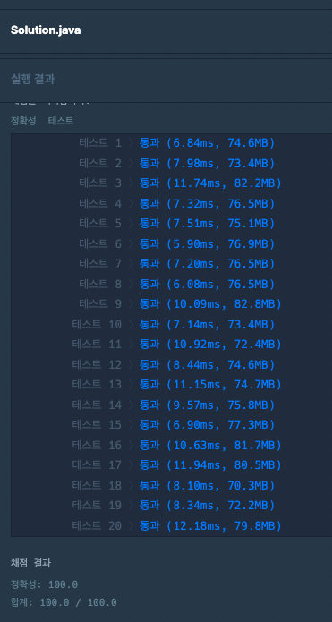

### [Level.1] 개인정보 수집 유효기간

- today를 계산을 편하게 하기위해 localDate로 변환해준다.
- term 종류와 유효기간을 map에 저장한다.
- privacies for문을 돌아 해당약관 유효기간만큼 localDate 추가해준다. 
- today보다 이전 날짜인지 체크한다.
- 시간복잡도 : O(N)

### 코드

```java
public List<Integer> solution(String today, String[] terms, String[] privacies) {
		List<Integer> answer = new ArrayList<>();
		DateTimeFormatter formatter = DateTimeFormatter.ofPattern("yyyy.MM.dd");
		LocalDate todayDate = LocalDate.parse(today, formatter);

		Map<String, Integer> map = new HashMap<>();

		for (String term : terms) {
			String[] termArray = term.split(" ");
			map.put(termArray[0], Integer.parseInt(termArray[1]));
		}

		for (int i = 0; i < privacies.length; i++) {
			String[] privacyArray = privacies[i].split(" ");

			int value = map.get(privacyArray[1]);

			LocalDate expirationDate = LocalDate.parse(privacyArray[0], formatter);
			expirationDate = expirationDate.plusMonths(value).minusDays(1);

			if (expirationDate.isBefore(todayDate)) {
				answer.add(i+1);
			}
		}
		return answer;
	}
```

### 결과


