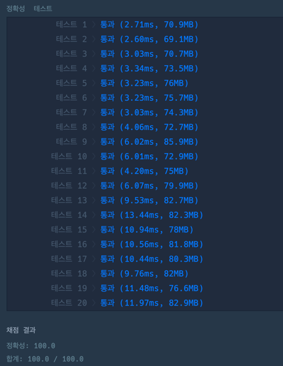

<div align="center">
<h1>🔥 두 큐 합 같게 만들기 🔥 </h1>
</div>

<br>

### **[ INDEX ]**
<details>
<summary>1. 문제 링크</summary>

[성격 유형 검사하기](https://school.programmers.co.kr/learn/courses/30/lessons/118666)
</details>
<details>
<summary>2. 문제 풀이</summary>

```java
public class Solution {
   static Map<String, Integer> types = new HashMap<>();

   public static void main(String[] args) {
      String[] survey = {"AN", "CF", "MJ", "RT", "NA"};
      int[] choices = {5, 3, 2, 7, 5};
      System.out.println(solution(survey, choices));
   }

   public static String solution(String[] survey, int[] choices) {
      for (int i = 0; i < survey.length; i++) {
         calculate(survey[i], choices[i]);
      }
      return combineAnswer();
   }

   private static String combineAnswer() {
      String answer = "";

      answer = types.getOrDefault("R", 0) >= types.getOrDefault("T", 0) ? answer + "R" : answer + "T";
      answer = types.getOrDefault("C", 0) >= types.getOrDefault("F", 0) ? answer + "C" : answer + "F";
      answer = types.getOrDefault("J", 0) >= types.getOrDefault("M", 0) ? answer + "J" : answer + "M";
      answer = types.getOrDefault("A", 0) >= types.getOrDefault("N", 0) ? answer + "A" : answer + "N";

      return answer;
   }

   private static void calculate(String eachSurvey, int choice) {
      String[] rowTypes = eachSurvey.split("");
      String firstType = rowTypes[0];
      String secondType = rowTypes[1];

      switch (choice) {
         case 1 -> types.put(firstType, types.getOrDefault(firstType, 0) + 3);
         case 2 -> types.put(firstType, types.getOrDefault(firstType, 0) + 2);
         case 3 -> types.put(firstType, types.getOrDefault(firstType, 0) + 1);
         case 5 -> types.put(secondType, types.getOrDefault(secondType, 0) + 1);
         case 6 -> types.put(secondType, types.getOrDefault(secondType, 0) + 2);
         case 7 -> types.put(secondType, types.getOrDefault(secondType, 0) + 3);
      }
   }
}
```

**[ 시간 복잡도 - O(n) ]**
</details>
<details>
<summary>3. 코드 결과</summary>


</details>