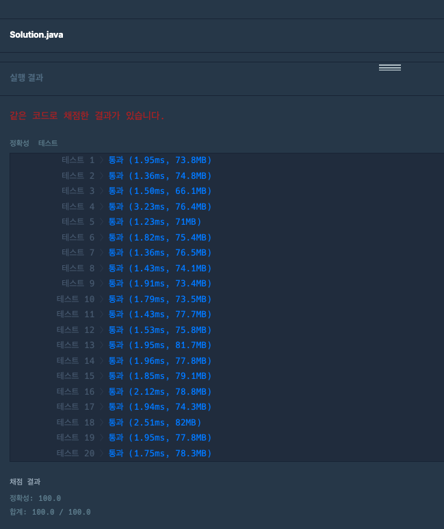

### [Level.1] 성격 유형 검사하기

- 각 성격을 map을 통해 점수와 같이 저장
- survey에서 들어온값이 4미만이라면 비동의로 앞에 원소에 해당하는값에 플러스
- survey에서 들어온값이 4초과라면 동의로 뒤에 원소에 해당하는값에 플러스
- 만약 값이 같다면 알파벳 순서가 빠른 것 출력
- 시간복잡도 : O(N)

### 코드

```java

public class kakao_2022_internship_02 {
	public static void main(String[] args) {
		String[] survey = {"AN", "CF", "MJ", "RT", "NA"};
		int[] choices = {5, 3, 2, 7, 5};
		System.out.println(solution(survey, choices));
	}

	public static String solution(String[] survey, int[] choices) {
		String answer = "";

		Map<String, Integer> map = new HashMap<>();
		map.put("R", 0);
		map.put("T", 0);
		map.put("C", 0);
		map.put("F", 0);
		map.put("J", 0);
		map.put("M", 0);
		map.put("A", 0);
		map.put("N", 0);

		for (int i = 0; i < survey.length; i++) {
			if (choices[i] < 4) {
				int score = 0;
				if (choices[i] == 1) {
					score = 3;
				}
				if (choices[i] == 2) {
					score = 2;
				}
				if (choices[i] == 3) {
					score = 1;
				}
				String first = String.valueOf(survey[i].charAt(0));
				int value = map.get(first);
				map.put(first, value + score);
			} else if (choices[i] > 4) {
				int score = choices[i] - 4;
				String second = String.valueOf(survey[i].charAt(1));
				int value = map.get(second);
				map.put(second, value + score);
			}
		}

		answer += map.get("R") >= map.get("T") ? "R" : "T";
		answer += map.get("C") >= map.get("F") ? "C" : "F";
		answer += map.get("J") >= map.get("M") ? "J" : "M";
		answer += map.get("A") >= map.get("N") ? "A" : "N";

		return answer;
	}
}

```

### 결과


