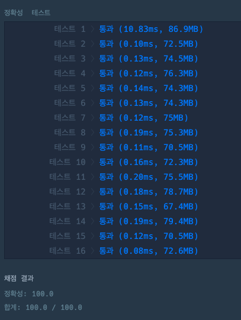

### Level.2 k진수에서 소수 개수 구하기
- n 을 입력받아 k진수로 변경해준다.
- 0을 기준으로 split하여 배열에 저장해준다.
- 해당 수 들을 탐색하여 10진법으로 변경하여 소수인지 아닌지 판별한다. 

### 코드

```java

public class kakao_k진수에서_소수_개수_구하기2 {
	public static void main(String[] args) {
		int n = 11000011;
		int k = 10;
		System.out.println(solution(n, k));
	}

	public static int solution(int n, int k) {
		int answer = 0;

		String number = Long.toString(n, k);

		String[] numbers = number.split("0");

		for (String s : numbers) {
			if (s.isEmpty()) {
				continue;
			}
			if (isPrime(Long.parseLong(s))) {
				answer++;
			}
		}
		return answer;
	}

	private static boolean isPrime(long n) {
		if (n == 1) {
			return false;
		}
		for (int i = 2; i <= (int)Math.sqrt(n); i++) {
			if (n % i == 0) {
				return false;
			}
		}
		return true;
	}
}

```

### 결과


