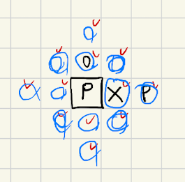
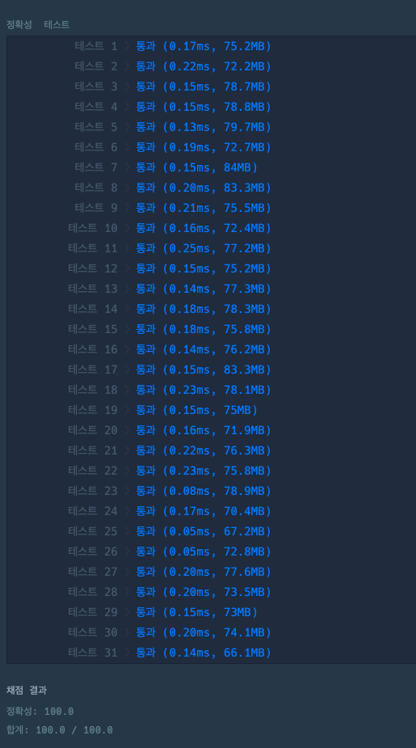

### [Level.2] 거리두기 확인하기

- 입력받은 이중배열 places를 반복문을 돌아 chars 이중배열로 변환후에 bfs를 이용해 탐색한다.
- 'P' 일경우 탐색을 시작해 상하좌우를 확인하여 'P' 일 경우는 바로 리턴한다.
- 만약 상하좌우에 'X'(칸막이), 'P'(사람) 가 아닌 'O'(빈칸) 이 있으면 더 탐색을 해봐야한다.
  - 'O'일경우 상하좌우를 한번 더 탐색해서 'P'가 있는지 확인한다. 이때 'P' 가 있다면 거리를 위반한것이다.
  - 처음 탐색을 시작한 'P'는 제외해야 한다.
- 한명이라도 거리를 위반하면 answer에 0을 넣고 아무도 위반하지 않았다면 1을 넣는다.

### 코드



```java

public static List<Integer> solution(String[][] places) {
		List<Integer> answer = new ArrayList<>();
		char[][] chars = new char[5][5];

		for (int i = 0; i < places.length; i++) {
			for (int j = 0; j < places[i].length; j++) {
				chars[j] = places[i][j].toCharArray();
			}
			int cnt = 0;
			loop:
			for (int j = 0; j < places[i].length; j++) {
				for (int k = 0; k < chars[j].length; k++) {
					if (chars[j][k] == 'P') {
						boolean check = bfs(chars, j, k);
						if (!check) {
							break loop;
						}
					}
					cnt++;
				}
			}

			if (cnt == 25) {
				answer.add(1);
			} else {
				answer.add(0);
			}
		}

		return answer;
	}

	public static boolean bfs(char[][] chars, int x, int y) {
		Queue<int[]> queue = new LinkedList<>();
		queue.add(new int[] {x, y});

		while (!queue.isEmpty()) {
			int q[] = queue.poll();
			int qx = q[0];
			int qy = q[1];

			for (int i = 0; i < dx.length; i++) {
				int nx = qx + dx[i];
				int ny = qy + dy[i];

				if (nx >= 0 && ny >= 0 && nx < 5 && ny < 5) {
					if (chars[nx][ny] == 'P') {
						return false;
					}
					if (chars[nx][ny] == 'O') { // 'O'일경우 한번더 탐색을 한다.
						for (int j = 0; j < dx.length; j++) {
							int nnx = nx + dx[j];
							int nny = ny + dy[j];

							if (nnx >= 0 && nny >= 0 && nnx < 5 && nny < 5) {
								// 처음 탐색을 시작한 값과 같은지 확인
								if (nnx == qx && nny == qy) {
									continue;
								}
								if (chars[nnx][nny] == 'P') {
									return false;
								}
							}
						}
					}
				}
			}
		}
		return true;
	}

```

### 결과


