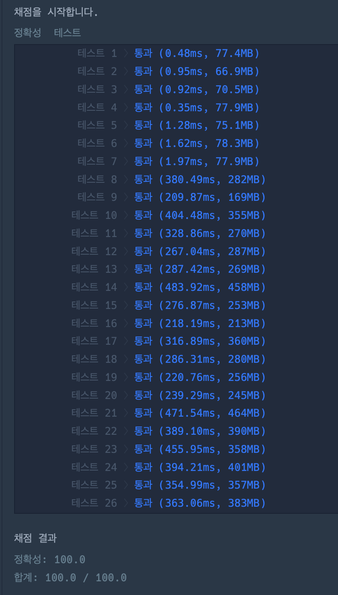

# [Level.2] 도넛과 막대 그래프

- 각 그래프에서 하나씩 가지고 있는 특별한 노드들이 가진 특징을 찾는다
- 이 때 모든 특징을 다 알 필요는 없다. 
- 2가지만 알아내서 계산으로 해결한다.

# 코드

```java
import java.util.HashMap;
import java.util.HashSet;
import java.util.Map;
import java.util.Set;

class Solution {
	public int[] solution(int[][] edges) {
		// 도넛, 막대, 8자
		int[] answer = {0, 0, 0, 0};

		Map<Integer, Set<Integer>> graph = new HashMap<>();
		Set<Integer> values = new HashSet<>();
		for (int[] edge : edges) {
			if (graph.containsKey(edge[0])) {
				graph.get(edge[0]).add(edge[1]);
			} else {
				HashSet<Integer> newSet = new HashSet<>();
				newSet.add(edge[1]);
				graph.put(edge[0], newSet);
			}
			values.add(edge[1]);
		}
		// 막대모양 그래프 갯수 세기
		for (Integer value : values) {
			if (!graph.containsKey(value)) {
				answer[2]++;
			}
		}

		int vertex = 0;
		for (Integer key : graph.keySet()) {
			// 정점 구하기
			if (!values.contains(key)) {
				if (vertex == 0) {
					vertex = key;
				} else if (graph.get(key).size() > graph.get(vertex).size()) {
					vertex = key;
				}
			}
			// 8자 그래프 갯수 구하기
			if (graph.get(key).size() >= 2 && values.contains(key)) {
				answer[3]++;
			}
		}
		answer[0] = vertex;
		// 정점 노드로부터 파생된 노드의 갯수
		int answerSum = graph.get(vertex).size();

		// 정점 노드 - 막대그래프 갯수 - 8자그래프 갯수
		answer[1] = answerSum - answer[3] - answer[2];
		return answer;
	}
}
```

# 결과



# 에러 발생 부분

1. dfs 로 접근. 런타임 에러 발생
