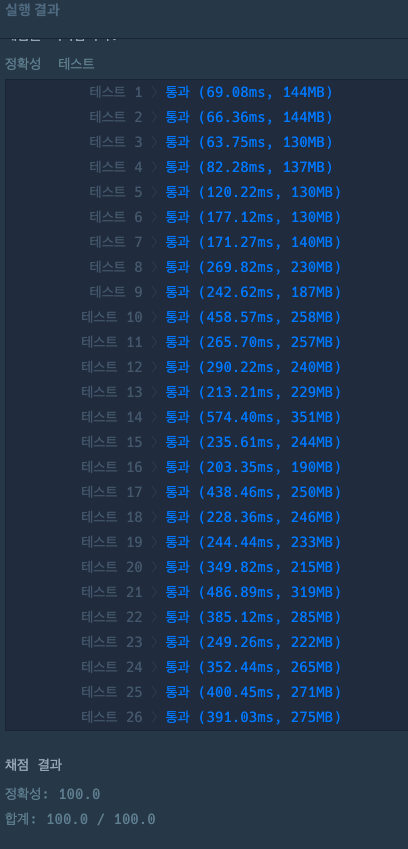

### [Level.2] 도넛과 막대 그래프
- 간선들이 주어졌을때 그래프를 그리기 위해서 인접리스트에 넣어준다.
- 간선을 가장 많이 가지고 있는 정점을 시작정점으로 둔다.
- 시작정점에서 연결된 정점들을 기준으로 bfs 탐색을한다.
- 각 bfs결과로 정점과 간선의 개수를 구해서 어떤 그래프인지 검사한다.

### 코드
```java

public class kakao_도넛과_막대_그래프 {
	static ArrayList<ArrayList<Integer>> graph;
	static boolean[] visited = new boolean[1000000];
	
	public static void main(String[] args) {
		int[][] edges = {{4, 11}, {1, 12}, {8, 3}, {12, 7}, {4, 2}, {7, 11}, {4, 8}, {9, 6}, {10, 11}, {6, 10}, {3, 5}, {11, 1}, {5, 3}, {11, 9}, {
		3, 8}};
		List<Integer> list = solution(edges);
		System.out.println(Arrays.toString(list.toArray()));
	}

	public static List<Integer> solution(int[][] edges) {
		List<Integer> answer = new ArrayList<>();
		graph=new ArrayList<>();

		for (int i = 0; i < 1000000; i++) {
			graph.add(new ArrayList<>());
		}

		for (int[] edge : edges) {
			graph.get(edge[0]).add(edge[1]);
		}

		int maxx = 0;
		int index = 0;

		int[] count = new int[1000000];

		// edge[0]이 가장 많은 노드를 정점으로 취급해보자
		for (int[] edge : edges) {
			count[edge[0]]++;
			if (count[edge[0]] > maxx) {
				maxx = count[edge[0]];
				index = edge[0];
			}
		}

		List<Integer> start = new ArrayList<>();

		// 정점에서 연결된 값들을 구한다
		for (int[] edge : edges) {
			if (index == edge[0]) {
				start.add(edge[1]);
			}
		}

		int donut = 0;
		int stick = 0;
		int eight = 0;

		for (Integer i : start) {
			Node node = bfs(i);

			// 도넛 모양 그래프 : 크기가 n이면 n개의 정점과 n개의 간선
			// 막대 모양 그래프 : 크기가 n이면 n개의 정점과 n-1개의 간선
			// 8자 모양 그래프 : 크기가 n이면 2n+1개의 정점과 2n+2개의 간선이 있다.

			if (node.vertex == node.line) {
				donut++;
			}
			if (node.vertex > node.line) {
				stick++;
			}
			if (node.vertex < node.line) {
				eight++;
			}
		}
		answer.add(index);
		answer.add(donut);
		answer.add(stick);
		answer.add(eight);

		return answer;
	}

	public static Node bfs(int V) {
		Queue<Integer> queue = new LinkedList<>();
		int vertex = 0;
		int line = 0;

		queue.add(V);
		visited[V] = true;

		while (!queue.isEmpty()) {
			int temp = queue.poll();
			vertex++;

			for (Integer i : graph.get(temp)) {
				line++;
				if (!visited[i]) {
					queue.add(i);
					visited[i] = true;
				}
			}
		}
		return new Node(vertex, line);
	}

	public static class Node {
		int vertex;
		int line;

		public Node(int vertex, int line) {
			this.vertex = vertex;
			this.line = line;
		}
	}
}

```

### 에러 발생한 부분
1. 메모리초과 

간선이 주어졌을때 처음에는 인접행렬로 이중배열 만들어서 담았더니 메모리초과가 발생했다.
간선의 개수도 백만, 정점도 백만이 있을수 있기때문에 인접리스트로 그래프 만들어야지 bfs탐색을 할수있다.

2. 런타임에러

그래프 초기화 할때나 다른값들 초기화 할때 edges.length를 사용했는데 이 값은 간선의 개수값이고 정점의 개수가 아니다
즉, edges.length가 5개여도 정점은 백만까지 들어올수 있기때문에 무조건 초기화를 백만으로 다 해줘야한다.


### 결과


