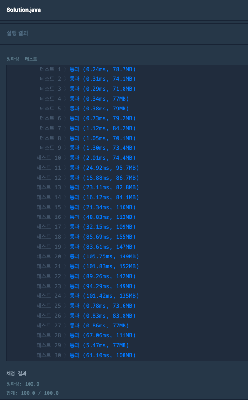

### [Level2] 두 큐 합 같게 만들기
- 큐를 사용하여 구현
- 리스트 전체 합 total이 홀수 이거나 전체합의 반 half보다 큰 원소가 있을경우 -1 리턴
- 두개 큐중 합이 큰 큐에서 poll, 다른 한개의 큐에 add
- 최악의 경우 queue * 3 만큼 반복

### 코드

```java
public static int solution(int[] queue1, int[] queue2) {
		int answer = 0;
		int count = 0;

		int size = queue1.length * 3;

		Queue<Long> q1 = new LinkedList<>();
		Queue<Long> q2 = new LinkedList<>();
		long totalQ1 = 0;
		long totalQ2 = 0;

		for (int i = 0; i < queue1.length; i++) {
			q1.add((long) queue1[i]);
			q2.add((long) queue2[i]);
			totalQ1 += queue1[i];
			totalQ2 += queue2[i];
		}

		long total = totalQ1 + totalQ2;

		if (total % 2 != 0) {
			return -1;
		}

		long half = total / 2;

		for (Long i : q1) {
			if (i > half) {
				return -1;
			}
		}

		for (Long i : q2) {
			if (i > half) {
				return -1;
			}
		}

		while (true) {
			if (totalQ1 > totalQ2) {
				long pop = q1.poll();
				totalQ1 -= pop;
				totalQ2 += pop;
				q2.add(pop);
				answer++;
			} else if (totalQ1 < totalQ2) {
				long pop = q2.poll();
				totalQ1 += pop;
				totalQ2 -= pop;
				q1.add(pop);
				answer++;
			} else {
				break;
			}

			if (count > size) {
				answer = -1;
				break;
			}
			count++;
		}

		return answer;
	}
```

### 결과


