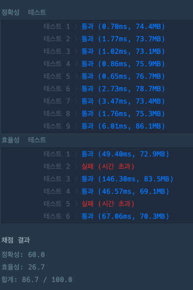

### [Level.2] 석유 시추

### 코드

```java

public class PCCP_석유_시추 {
	static int[] dx = {-1, 1, 0, 0};
	static int[] dy = {0, 0, -1, 1};
	static boolean[][] visited;
	static Map<Node, Result> map = new HashMap<>();

	public static void main(String[] args) {
		int[][] land = {{0, 0, 0, 1, 1, 1, 0, 0}, {0, 0, 0, 0, 1, 1, 0, 0}, {1, 1, 0, 0, 0, 1, 1, 0}, {1, 1, 1, 0, 0, 0, 0, 0}, {1, 1, 1, 0, 0, 0, 1, 1}};
		int answer = solution(land);
		System.out.println(answer);
	}

	public static int solution(int[][] land) {
		int maxx = 0;
		int bfsCount = 1;
		visited = new boolean[land.length][land[0].length];

		for (int i = 0; i < land.length; i++) {
			for (int j = 0; j < land[0].length; j++) {
				if (land[i][j] == 1 && !visited[i][j]) {
					bfs(land, i, j, bfsCount);
					bfsCount++;
				}
			}
		}

		for (int i = 0; i < land[0].length; i++) {
			Map<Integer, Boolean> checkMap = new HashMap<>();
			int sum = 0;
			for (int j = 0; j < land.length; j++) {
				if (land[j][i] == 1) {
					Result result = map.get(new Node(j,i));
					if (result != null) {
						if (checkMap.containsKey(result.bfsCount)) {
							continue;
						} else {
							checkMap.put(result.bfsCount, true);
							sum += result.count;
						}
					}
				}
			}
			maxx = Math.max(maxx, sum);
		}
		return maxx;
	}

	public static void bfs(int[][] land, int a, int b, int bfsCount) {
		Queue<Node> queue = new LinkedList<>();
		queue.add(new Node(a, b));
		visited[a][b] = true;
		int count = 1;
		List<Node> list = new ArrayList<>();
		list.add(new Node(a, b));


		while (!queue.isEmpty()) {
			Node node = queue.poll();
			int x = node.x;
			int y = node.y;
			for (int i = 0; i < 4; i++) {
				int nx = x + dx[i];
				int ny = y + dy[i];

				if (nx >= 0 && ny >= 0 && nx < land.length && ny < land[0].length) {
					if (!visited[nx][ny] && land[nx][ny] == 1) {
						queue.add(new Node(nx, ny));
						visited[nx][ny] = true;
						count++;
						list.add(new Node(nx, ny));
					}
				}
			}
		}

		for (Node node : list) {
			map.put(node, new Result(count, bfsCount));
		}
	}

	public static class Node {
		int x;
		int y;

		public Node(int x, int y) {
			this.x = x;
			this.y = y;
		}

		@Override
		public boolean equals(Object o) {
			if (this == o)
				return true;
			if (o == null || getClass() != o.getClass())
				return false;
			Node node = (Node)o;
			return x == node.x && y == node.y;
		}

		@Override
		public int hashCode() {
			return Objects.hash(x, y);
		}
	}

	public static class Result {
		int count;
		int bfsCount;

		public Result(int count, int bfsCount) {
			this.count = count;
			this.bfsCount = bfsCount;
		}

		@Override
		public boolean equals(Object o) {
			if (this == o)
				return true;
			if (o == null || getClass() != o.getClass())
				return false;
			Result result = (Result)o;
			return count == result.count && bfsCount == result.bfsCount;
		}

		@Override
		public int hashCode() {
			return Objects.hash(count, bfsCount);
		}
	}
}

```


### 결과


