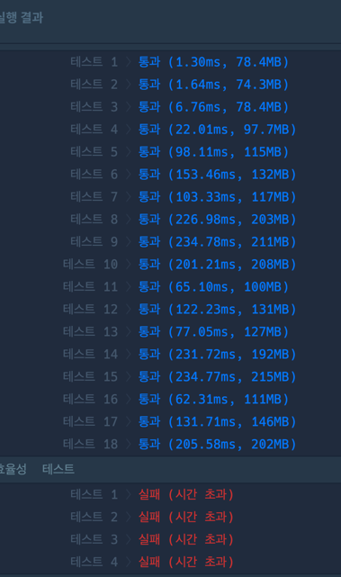

### 순위검색

효율성 실패

### 코드

```java

public class kakao_순위검색_1 {
	public static void main(String[] args) {
		String[] info = {"java backend junior pizza 150","python frontend senior chicken 210","python frontend senior chicken 150","cpp backend senior pizza 260","java backend junior chicken 80","python backend senior chicken 50"};
		String[] query = {"java and backend and junior and pizza 100","python and frontend and senior and chicken 200","cpp and - and senior and pizza 250","- and backend and senior and - 150","- and - and - and chicken 100","- and - and - and - 150"};
		List<Integer> answer = solution(info, query);
		System.out.println(Arrays.toString(answer.toArray()));
	}

	public static List<Integer> solution(String[] info, String[] query) {
		List<Integer> answer = new ArrayList<>();

		for (String s : query) {
			int cnt = 0;
			String replace1 = s.replace(" and", "");
			String replace2 = replace1.replace(" -", "");
			String replace3 = replace2.replace("- ", "");

			int queryLastIndex = replace3.lastIndexOf(" ");
			String queryLeft = "";
			if (queryLastIndex != -1) {
				queryLeft = replace3.substring(0, queryLastIndex);
			}
			int queryRight = Integer.parseInt(replace3.substring(queryLastIndex+1));

			String[] querys = {};
			if (!queryLeft.equals("")) {
				 querys = queryLeft.split(" ");
			}
			List<String> queryList = Arrays.asList(querys);

			for (int i = 0; i < info.length; i++) {
				String[] infos = info[i].split(" ");
				List<String> infoList = Arrays.asList(infos);

				if (infoList.containsAll(queryList) && Integer.parseInt(infos[infos.length-1]) >= queryRight) {
					cnt++;
				}
			}
			answer.add(cnt);
		}

		return answer;
	}
}

```

### 결과



