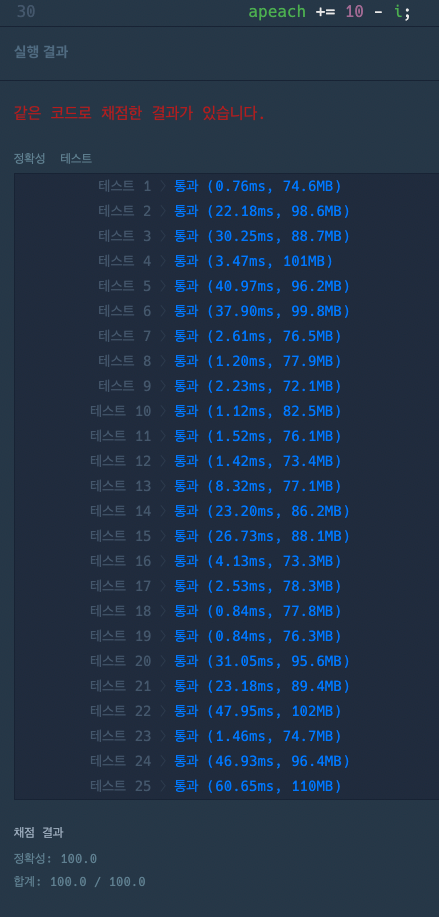

### [Level.2] 양궁대회

- 가장 큰 점수차로 우승한 경우를 구해야하기 때문에 그리디로는 못풀고 완전탐색을 재귀로 구현한다.
- 라이언이 쏜경우, 쏘지않은경우 를 모두 탐색한다 (재귀로구현)
  - 라이언이 쏜경우 n횟수를 감소하고 배열에 -1 을 해주고 index는 그대로 둔다.
  - 라이언이 쏘지않았을경우 n횟수, 배열은 그대로고 index를 늘린다.
- n횟수를 다 돌았을경우, 배열 인덱스를 다 돌았을경우에 탈출 할 수 있도록 탈출조건을 설정한다.
- 결과물 배열로 승자를 찾아 점수를 부여한다.
- `maxArray` 배열을 찾기 위해서 `maxx` 값이 변할때마다 라이언이 던진 배열을 계산한다.
- 만약 `maxx`와 현재 계산한 값이 같을 경우에는 낮은 점수에 더 많이 맞춘 배열을 선택하는 로직을 수행한다.


### 코드

```java

public class kakao_양궁대회 {

	static int maxx = 0;
	static int[] maxArray;
	static int[] init;

	public static void main(String[] args) {
		// int n = 5;
		// int[] info = {2,1,1,1,0,0,0,0,0,0,0};
		// [0,2,2,0,1,0,0,0,0,0,0]

		int n = 9;
		int[] info = {0,0,1,2,0,1,1,1,1,1,1};
		// 	[1,1,2,0,1,2,2,0,0,0,0]
		solution(n, info);
	}

	public static int[] solution(int n, int[] info) {

		init = info.clone();
		maxArray = new int[info.length];

		recursive(n, info, 0);

		int sum = Arrays.stream(maxArray).sum();
		if (sum == 0 || maxx == 0) { // 서로 비겼을경우
			return new int[]{-1};
		}
		return maxArray;
	}

	public static void recursive(int n, int[] info, int index) {
		if (n == 0 || index == info.length) { // 탈출조건
			int lion = 0;
			int apeach = 0;

			for (int i = 0; i < info.length; i++) { // 결과물 배열로 라이언이 이겼는지 어피치가 이겼는지 판단
				if (info[i] > 0) { // 어피치 승
					apeach += 10 - i;
				} else if (info[i] == 0 && init[i] != 0) { // 증가했다 줄었다 한 0인지 아니면 처음부터 0인 값인지 확인
					apeach += 10 - i;
				}
				else if (info[i] < 0) { // 라이언 승
					lion += 10 - i;
				}
			}

			int cloneMaxx = maxx;
			maxx = Math.max(maxx, lion - apeach);

			if (cloneMaxx != maxx) { // cloneMaxx랑 maxx가 다를경우에는 maxx 값이 바뀐거기 때문에 이때 라이언이 던진 배열 계산
				for (int i = 0; i < maxArray.length; i++) {
					if (init[i] == info[i]) { // init 값이랑 info 값이랑 다른게 없다면 라이언이 던진게 하나도 없다.
						maxArray[i] = 0;
					} else if (init[i] > info[i]) { // init이 더 큰 경우 라이언이 던진게 있다.
						maxArray[i] = init[i] - info[i];
					}
				}
			}

			if (maxx == lion - apeach) { // maxx 점수가 같을경우에는 낮은 점수에 더 많이 맞춘 배열을 택한다.
				int[] temp = new int[maxArray.length];

				// 위와 같이 점수계산후 temp에 넣음
				for (int i = 0; i < maxArray.length; i++) {
					if (init[i] == info[i]) {
						temp[i] = 0;
					} else if (init[i] > info[i]) {
						temp[i] = init[i] - info[i];
					}
				}

				// 뒤에서부터 for문을 돌면서 먼저 큰 값이 나오는 배열을 maxArray에 저장
				for (int i = temp.length-1; i >= 0; i--) {
					if (temp[i] > maxArray[i]) {
						maxArray = temp.clone();
						return;
					} else if (temp[i] < maxArray[i]) {
						return;
					}
				}
			}

			return;
		}

		int[] temp = info.clone();
		temp[index] -= 1;
		recursive(n-1, temp, index);
		recursive(n, info, index + 1);

	}
}

```


### 결과


