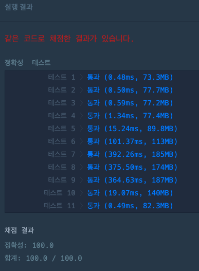

### [Level.2] 요격 시스템

### 풀이 참고 코드

```java
public class 요격_시스템 {
	public static void main(String[] args) {
		int[][] targets = {{4,5},{4,8},{10,14},{11,13},{5,12},{3,7},{1,4}};
		int answer = solution(targets);
		System.out.println(answer);
	}
	public static int solution(int[][] targets) {
		int answer = 0;

		Arrays.sort(targets, (o1, o2) -> o1[1] - o2[1]);
		// [[1, 4], [4, 5], [3, 7], [4, 8], [5, 12], [11, 13], [10, 14]]

		int before = 0;
		for(int i=0;i<targets.length;i++){
			// 이전 타겟과 겹치지 않는다면 현재 타겟을 선택
			if(before <= targets[i][0]){
				before = targets[i][1]; // 현재 타켓에 끝점을 넣음
				answer++;
			}
		}

		return answer;
	}
}
```

### 결과


