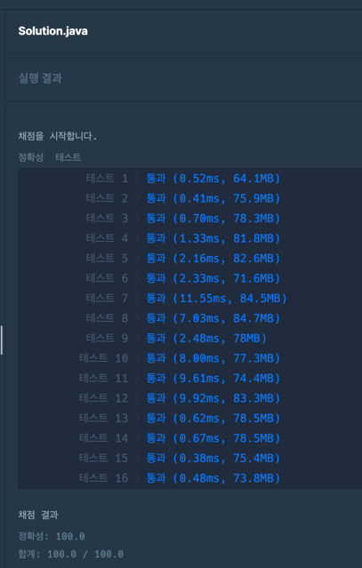

### [Level.2] 주차 요금 계산

- 차량이 'IN' 했을경우 map에 넣어주고 'OUT' 했을경우 주차시간을 계산하여 resultMap에 넣어주고 map에서 제거한다.
- map에 계속 남아있는 차량은 출차를 안한차량이므로 23:59으로 주차시간을 계산하여 resultMap에 넣어준다.
- 차량번호순으로 resultMap을 탐색해 주차시간을 비용으로 환산한다.
  - 주차시간이 기본시간보다 작으면 기본요금만 나온다.
  - 주차시간이 기본시간보다 더 크다면 단위시간당 단위요금을 추가하고 나머지값은 올림해준다.

### 코드

```java

public static List<Integer> solution(int[] fees, String[] records) {
		List<Integer> answer = new ArrayList<>();

		int basicTime = fees[0];
		int basicAmount = fees[1];
		int unitTime = fees[2];
		int unitAmount = fees[3];
		int lastTimeMin = 23 * 60 + 59;

		Map<Integer, String> map = new HashMap<>(); // number, time
		Map<Integer, Integer> resultMap = new HashMap<>(); // number, remainMin

		for (String record : records) {
			String[] split = record.split(" ");
			String time = split[0];
			Integer number = Integer.valueOf(split[1]);
			String parking = split[2];
			if (parking.equals("IN")) {
				map.put(number, time);
			} else {
				String inTime = map.get(number);
				Integer inTimeMin = getMinute(inTime);
				Integer outTimeMin = getMinute(time);

				Integer remainMin = outTimeMin - inTimeMin;

				// resultMap에 존재한다면 이미 계산한 금액이 존재하므로 누적으로 쌓는다.
				if (resultMap.get(number) == null) {
					resultMap.put(number, remainMin);
				} else {
					resultMap.put(number, resultMap.get(number) + remainMin);
				}
				map.remove(number);
			}
		}

		// map에 남아있는게 있다면 "OUT"을 안한 차량이다.
		for (Integer number : map.keySet()) {
			String time = map.get(number);
			Integer inTimeMin = getMinute(time);

			Integer remainMin = lastTimeMin - inTimeMin;

			if (resultMap.get(number) == null) {
				resultMap.put(number, remainMin);
			} else {
				resultMap.put(number, resultMap.get(number) + remainMin);
			}
		}

		List<Integer> carNumbers = new ArrayList<>(resultMap.keySet());
		Collections.sort(carNumbers);

		// 주차시간으로 요금계산
		for (Integer carNumber : carNumbers) {
			int parkingTime = resultMap.get(carNumber);

			if (parkingTime <= basicTime) {
				answer.add(basicAmount);
			} else {
				int totalAmount = 0;

				parkingTime -= basicTime;
				totalAmount += basicAmount;

				int unit = parkingTime / unitTime;
				int remainTime = parkingTime % unitTime;

				totalAmount += unit * unitAmount;

				// 올림처리
				if (remainTime > 0) {
					totalAmount += unitAmount;
				}
				answer.add(totalAmount);
			}
		}

		return answer;
	}

	private static Integer getMinute(String inTime) {
		String[] timeMins = inTime.split(":");
		Integer timeMin = Integer.valueOf(timeMins[0]) * 60 + Integer.valueOf(timeMins[1]);
		return timeMin;
	}

```


### 결과


