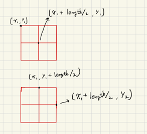
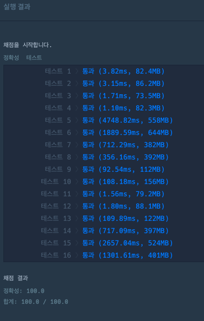

### 쿼드압축 후 개수 세기

- 재귀를 이용해 계속해서 4개의 사분면으로 나눈다.
- 1개의 사분면씩 bfs로 탐색하여 모두 같은수인지 검사한다.
- 사분면의 값이 모두 같은수가 아니면 계속 나눠주고 길이가 1이되면 answer에 더해준다.
- 만약 길이가 1전에 모두 같은수가 되면 뭉쳐서 하나의 값으로 취급한다.



### 코드

```java

public class 월간코드_쿼드압축_후_개수_세기 {
	public static final int[] dx = {-1, 1, 0, 0};
	public static final int[] dy = {0, 0 , -1, 1};
	public static final Map<Integer, Integer> map = new HashMap<>();
	public static void main(String[] args) {
		int[][] arr = {{1,1,0,0},{1,0,0,0},{1,0,0,1},{1,1,1,1}};
		int[] answer = solution(arr);
		System.out.println(Arrays.toString(answer));
	}

	public static int[] solution(int[][] arr) {
		int[] answer = new int[2];
		int length = arr.length;
		map.put(0, 0);
		map.put(1, 0);

		recursive(arr, 0, 0, length, length, length);

		answer[0] = map.get(0);
		answer[1] = map.get(1);

		return answer;
	}

	public static void recursive(int[][] arr, int x1, int y1, int x2, int y2, int length) {
		// 탈출조건
		if (length == 1) {
			if (arr[x1][y1] == 1) {
				map.put(1, map.get(1) + 1);
			} else if (arr[x1][y1] == 0) {
				map.put(0, map.get(0) + 1);
			}
			return;
		}

		boolean check = bfs(arr, x1, y1, x2, y2);

		// 탈출조건
		if (check) {
			map.put(arr[x1][y1], map.get(arr[x1][y1]) + 1);
			return;
		}

		// 1,2,3,4 사분면으로 나눠서 재귀
		recursive(arr, x1, y1, x1 + length/2, y1 + length/2, length/2);
		recursive(arr, x1, y1 + length/2, x1 + length/2, y2, length/2);
		recursive(arr, x1 + length/2, y1, x2, y1 + length/2, length/2);
		recursive(arr, x1 + length/2, y1 + length/2, x2, y2, length/2);
	}

	public static boolean bfs(int[][] arr, int x1, int y1, int x2, int y2) {
		Queue<Node> queue = new LinkedList<>();
		queue.add(new Node(x1, y1));
		boolean[][] bfsVisited = new boolean[arr.length][arr.length];
		int key = arr[x1][y1];
		bfsVisited[x1][y1] = true;

		while (!queue.isEmpty()) {
			Node node = queue.poll();
			int qx = node.x;
			int qy = node.y;
			for (int i = 0; i <4; i++) {
				int nx = qx + dx[i];
				int ny = qy + dy[i];

				if (nx >= x1 && ny >= y1 && nx < x2 && ny < y2) {
					if (!bfsVisited[nx][ny]) {
						bfsVisited[nx][ny] = true;
						if (key == arr[nx][ny]) {
							queue.add(new Node(nx, ny));
						} else {
							return false;
						}
					}
				}
			}
		}
		return true;
	}

	public static class Node{
		int x;
		int y;

		public Node(int x, int y) {
			this.x = x;
			this.y = y;
		}
	}
}

```

### 결과


