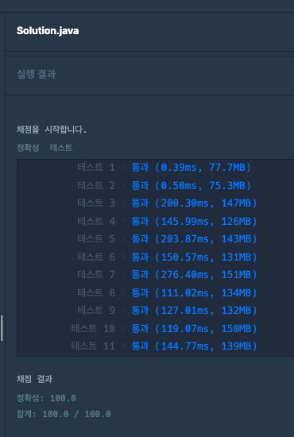

### [Level.2] 행렬 테두리 회전하기

- rows, columns 만큼 배열을 만들어서 값을 채워넣는다.
- queries를 한개씩 확인해 `(x1, y1)` 에서 `(x2, y2)` 까지 확인해 값들을 map에 넣는다.
  - 좌표값에 x1,y1,x2,y2 가 한개도 없을경우 중앙에 있는 값이므로 넘어간다.
  - 최솟값을 구한다. (회전한다고 값이 없어지거나 생기는게 아니기때문에 회전전에 구해도 상관없다.)
- 이제 값들을 시계방향으로 회전을 진행한다.
  - x == x1 랑 같으면 왼쪽껄 가져온다. 왼쪽이 범위 벗어나면 가져오지 x
  - y == y2 랑 같으면 위에껄 가져온다. 위에가 범위 벗어나면 가져오지 x
  - x == x2 랑 같으면 오른쪽껄 가져온다. 오른쪽이 범위 벗어나면 가져오지 x
  - y == y1 랑 같으면 아래껄 가져온다. 아래가 범위 벗어나면 가져오지 x


### 코드

```java

public class kakao_행렬_테두리_회전하기 {

	public static void main(String[] args) {
		int rows = 6;
		int columns = 6;
		int[][] queries = {{2,2,5,4},{3,3,6,6},{5,1,6,3}};
		List<Integer> answer = solution(rows, columns, queries);
		for (int i : answer) {
			System.out.print(i + " ");
		}
	}

	public static List<Integer> solution(int rows, int columns, int[][] queries) {
		List<Integer> answer = new ArrayList<>();

		int[][] array = new int[rows+1][columns+1];

		int val = 1;

		for (int i = 1; i <= rows; i++) {
			for (int j = 1; j <= columns; j++) {
				array[i][j] = val;
				val++;
			}
		}

		for (int[] query : queries) {
			int x1 = query[0];
			int y1 = query[1];
			int x2 = query[2];
			int y2 = query[3];
			int minn = Integer.MAX_VALUE;

			Map<Node, Integer> map = new HashMap<>();

			for (int i = x1; i <= x2; i++) {
				for (int j = y1; j <= y2; j++) {
					if (i == x1 || j == y1 || i == x2 || j == y2) {
						map.put(new Node(i, j), array[i][j]);
						minn = Math.min(minn, array[i][j]);
					}
				}
			}
			answer.add(minn);

			for (Node node : map.keySet()) {
				int x = node.x;
				int y = node.y;
				// x == x1 랑 같으면 왼쪽껄 가져온다. 왼쪽이 범위 벗어나면 가져오지 x
				if (x == x1) {
					if (y != y1) {
						array[x][y] = map.get(new Node(x, y-1));
					}
				}

				// y == y2 랑 같으면 위에껄 가져온다. 위에가 범위 벗어나면 가져오지 x
				if (y == y2) {
					if (x != x1) {
						array[x][y] = map.get(new Node(x-1, y));
					}
				}

				// x == x2 랑 같으면 오른쪽껄 가져온다. 오른쪽이 범위 벗어나면 가져오지 x
				if (x == x2) {
					if (y != y2) {
						array[x][y] = map.get(new Node(x, y+1));
					}
				}

				// y == y1 랑 같으면 아래껄 가져온다. 아래가 범위 벗어나면 가져오지 x
				if (y == y1) {
					if (x != x2) {
						array[x][y] = map.get(new Node(x+1, y));
					}
				}
			}
		}

		return answer;
	}

	public static class Node {
		public int x;
		public int y;

		public Node(int x, int y) {
			this.x = x;
			this.y = y;
		}

		@Override
		public boolean equals(Object o) {
			if (this == o)
				return true;
			if (o == null || getClass() != o.getClass())
				return false;
			Node node = (Node)o;
			return x == node.x && y == node.y;
		}

		@Override
		public int hashCode() {
			return Objects.hash(x, y);
		}
	}
}

```


### 결과


