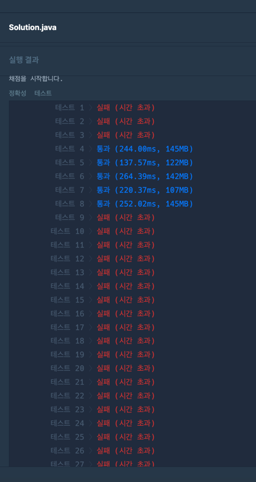
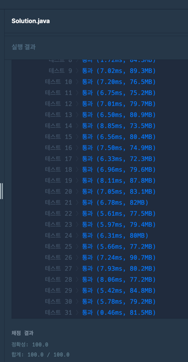

### [Level.3] 미로 탈출 명령어

- 시작지점부터 목표지점까지 가는 모든 경우의수를 구한다 -> bfs 사용
  - 모든 경우의수를 구하게되면 시간초과 발생하여 최적화 진행
    - k에서 이동한값을 뺐을때 남은거리보다 크거나 같을경우에만 진행한다.
    - k에서 이동한값을 빼고 남은거리를 뺐을때 짝수일때 진행한다. -> 짝수여야만 돌아올수 있으므로
- 목표지점에 도달했을때 result에 길이가 k일경우 list에 넣어준다.
- 사전순으로 정렬하여 가장 빠른값을 가져온다.
- 시간복잡도
  - 코드-1 : O(N^k) ?
  - 코드-2 : O(N) ?

### 코드 - 1 (시간초과)

```java

public static String solution(int n, int m, int x, int y, int r, int c, int k) {

		// 위, 아래, 왼, 오
		int[] dx = {-1,1,0,0};
		int[] dy = {0,0,-1,1};
		String[] dc = {"u", "d", "l", "r"};
		List<String> resultList = new ArrayList<>();

		Queue<Node> queue = new LinkedList<>();
		queue.add(new Node(x, y, ""));

		while (!queue.isEmpty()) {
			Node node = queue.remove();
			for (int i = 0; i < 4; i++) {
				int nx = node.x + dx[i];
				int ny = node.y + dy[i];
				if (0 < nx && 0 < ny && nx <= n && ny <= m) {
					String result = node.result + dc[i];
					if (node.result.length() < k) {
						queue.add(new Node(nx, ny, result)); // 상하좌우 이동하고 result에는 문자열 추가해서 queue를 계속돌아준다.
					}
					if (nx == r && ny == c && k == result.length()) { // 목적지에 도착했을때 K와 길이가 같다면 list에 추가한다.
						resultList.add(result);
					}
				}
			}
		}
		if (resultList.isEmpty()) {
			return "impossible";
		}
		Collections.sort(resultList);
		return resultList.get(0);
	}

	public static class Node {
		int x;
		int y;
		String result;

		public Node(int x, int y, String result) {
			this.x = x;
			this.y = y;
			this.result = result;
		}
	}

```

### 코드 - 2 (탈출조건 아이디어 참고)

```java

public static String solution(int n, int m, int x, int y, int r, int c, int k) {
		// 아래, 왼, 오, 위
		int[] dx = {1,0,0,-1};
		int[] dy = {0,-1,1,0};
		String[] dc = {"d", "l", "r", "u"}; // 사전순으로 돌아보기 위함
		List<String> resultList = new ArrayList<>();

		Queue<Node> queue = new LinkedList<>();
		queue.add(new Node(x, y, ""));

		int move = 0;
		while (!queue.isEmpty()) {
			move++;
			Node node = queue.remove();
			for (int i = 0; i < 4; i++) {
				int nx = node.x + dx[i];
				int ny = node.y + dy[i];
				int remainDistance = Math.abs(nx - r) + Math.abs(ny - c); // 두점 사이의 가로 세로 거리 합
				if (0 < nx && 0 < ny && nx <= n && ny <= m) {
					// 모든 경우를 돌아보는게 아니라 의미있는 경우만 진행한다.
					// 1. k에서 이동한값을 뺐을때 남은거리보다 크거나 같을경우에만 진행한다.
					// 2. k에서 이동한값을 빼고 남은거리를 뺐을때 짝수일때 진행한다. -> 짝수여야만 돌아올수 있으므로
					if (k - move >= remainDistance && (k - move - remainDistance) % 2 == 0) {
						String result = node.result + dc[i];
						if (node.result.length() < k) {
							queue.add(new Node(nx, ny, result));
						}
						if (nx == r && ny == c && k == result.length()) {
							resultList.add(result);
						}
						break; // d, l, r, u 사전순으로 진행하여 해당값이 넣어질경우 나머지는 안봐도된다.
					}
				}
			}
		}
		if (resultList.isEmpty()) {
			return "impossible";
		}
		Collections.sort(resultList);
		return resultList.get(0);
	}

	public static class Node {
		int x;
		int y;
		String result;

		public Node(int x, int y, String result) {
			this.x = x;
			this.y = y;
			this.result = result;
		}
	}

```


### 코드-1 결과



### 코드-2 결과


