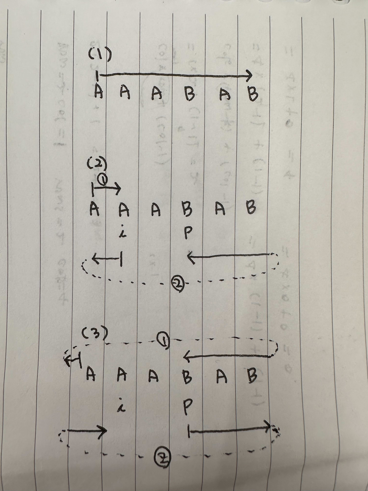

## 문제

- [조이 스틱](https://school.programmers.co.kr/learn/courses/30/lessons/42860)

## 복잡도

- 시간 복잡도: O(N)

## 풀이 과정

(1) ⬇️⬆️ 키를 사용해야 하는 횟수 구하기

- A에서 B 방향으로 하나씩 이동했을 때 거리와 A에서 Z 방향으로 하나씩 이동했을 때 거리를 비교한다.
- 더 작은 수를 answer에 더한다.

(2) ⬅️➡️ 키를 사용해야 하는 횟수 구하기

- name에서 연속되는 A가 있으면 `연속되는 A의 마지막 인덱스의 다음 인덱스(lastANextIndex)`를 계산한다. (A가 연속되는 구간은 방문하지 않아도 되기 때문)
- 변경이 필요한 모든 문자를 방문하는 가장 짧은 거리를 계산한다.
- - 가장 짧은 거리를 경우의 수는 세 가지다. (그림 참고)
- - (1) 0 번째 인덱스에서 마지막 인덱스까지 순차적으로 방문 한다.
- - (2) 0 번째 인덱스에서 현재 인덱스까지 오른쪽 방향으로 갔다가 현재 인덱스에서 왼쪽 방향으로 `lastANextIndex` 까지 방문한다.
- - (3) 0 번째 인덱스에서 `lastANextIndex`까지 왼쪽 방향으로 갔다가 `lastANextIndex`에서 오른쪽 방향으로 현재 인덱스까지 방문한다.

    
  <br/>

### 최종 답안

```js
function solution(name) {
  let answer = 0
  let minMove = name.length - 1

  ;[...name].map((character, i) => {
    // ASCII A=65, Z=91
    answer += Math.min(character.charCodeAt() - 65, 91 - character.charCodeAt())

    // 연속되는 A 중 마지막 인덱스
    let lastANextIndex = i + 1

    while (lastANextIndex < name.length && name[lastANextIndex] === "A") {
      lastANextIndex++
    }

    minMove = Math.min(
      minMove,
      i * 2 + name.length - lastANextIndex, // 0에서 i 까지 오른쪽방향을 갔다가 i에서 왼쪽 방향으로 lastA의 다음 인덱스까지 가는 횟수
      i + 2 * (name.length - lastANextIndex) // 0에서 왼쪽방향으로 lastA의 다음 인덱스까지 갔다가 오른쪽방향으로 i까지 가는 횟수
    )
  })

  return answer + minMove
}
```

---

### 번외 (성공하지 못했지만 생각했던 접근법)

#### 실패 코드 - 현재 인덱스에서 가장 가까운 변경이 필요한 문자로 이동하는 방법

```js
function solution(name) {
  var answer = 0

  // 변경이 필요없거나 변경을 완료한 문자 수
  let clearCnt = 0
  const isChangeDone = new Array(name.length).fill(false)
  for (let i = 0; i < name.length; i++) {
    if (name[i] === "A") {
      clearCnt++
      isChangeDone[i] = true
    }
  }

  // 지금 위치에서 가장 가까운 변경이 필요한 문자의 인덱스 찾기
  const getNearestCharacterIndex = (currIndex) => {
    for (let i = 1; i < name.length / 2; i++) {
      const leftIndex =
        currIndex - i >= 0 ? currIndex - i : name.length - (i - currIndex)
      const rightIndex =
        currIndex + i >= name.length
          ? currIndex + i - name.length
          : currIndex + i

      if (isChangeDone[leftIndex] === false) return [leftIndex, i]
      if (isChangeDone[rightIndex] === false) return [rightIndex, i]
    }

    return [-1, -1]
  }

  // 문자가 A와 가까운 지 Z와 가까운 지 판별
  const changeCharacterCount = (targetCharacter) => {
    if (targetCharacter === "A") return 0

    const fromADistance = targetCharacter.charCodeAt() - "A".charCodeAt()
    const fromZDistance = "Z".charCodeAt() - targetCharacter.charCodeAt() + 1 // a -> z로 가기 위한 조작이 필요하기 때문에 +1

    return Math.min(fromADistance, fromZDistance)
  }

  // 인덱스 0 번부터 시작
  // 0번이 바꿔야하는 지 판별
  if (name[0] !== "A") {
    answer += changeCharacterCount(name[0])
    isChangeDone[0] = true
    clearCnt++
  }

  let searchIndex = [0, -1]
  while (clearCnt !== name.length) {
    searchIndex = getNearestCharacterIndex(searchIndex[0])

    if (searchIndex[0] === -1) break

    const targetCharacter = name[searchIndex[0]]
    answer += searchIndex[1]
    isChangeDone[searchIndex[0]] = true

    answer += changeCharacterCount(targetCharacter)

    clearCnt++
  }

  return answer
}
```
